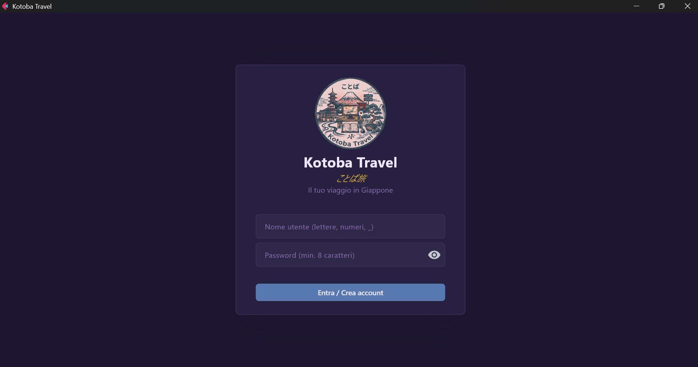
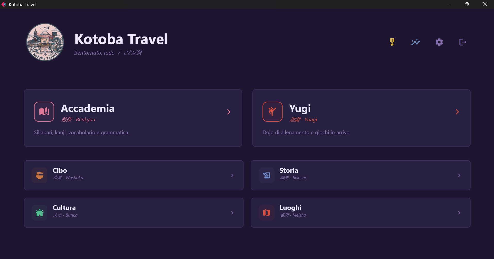
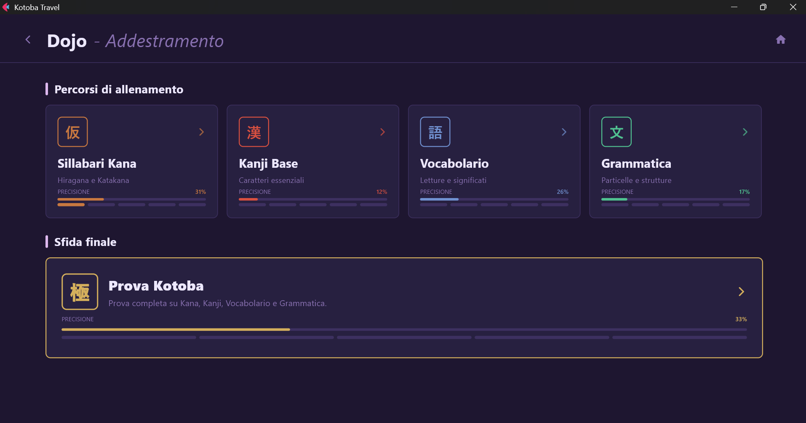
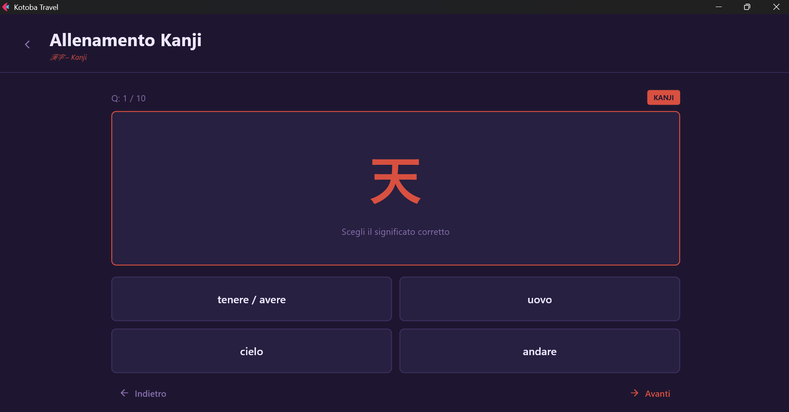
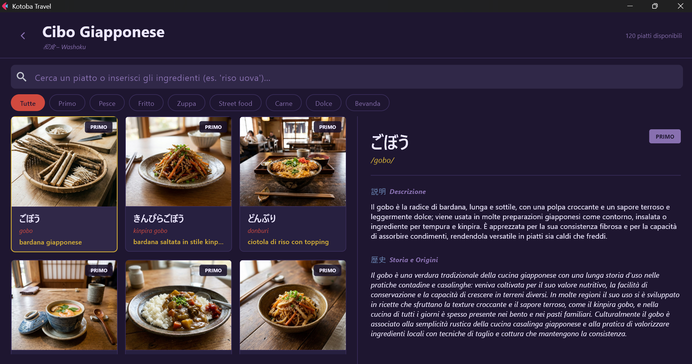

<div align="center">


# 言葉 Kotoba Travel

**Impara il giapponese attraverso viaggi, cucina, cultura e quiz.**  
App desktop gratuita, completamente offline. Nessun account, nessun abbonamento.

[](https://github.com/Rigel899/KOTOBA-TRAVEL/releases/latest)
[](https://github.com/Rigel899/KOTOBA-TRAVEL/releases/latest)
[](https://github.com/Rigel899/KOTOBA-TRAVEL/releases/latest)
[](LICENSE)

[⬇ Scarica ora](#scarica) · [Anteprima](#anteprima) · [Cosa include](#cosa-include) · [Come installare](#installazione)

</div>

---

## Anteprima

<table width="100%">
<tr>
<td width="50%"></td>
<td width="50%"></td>
</tr>
<tr>
<td width="50%"></td>
<td width="50%"></td>
</tr>
<tr>
<td width="50%"></td>
<td width="50%"></td>
</tr>
</table>

---

## Scarica

<table width="100%">
<tr>
<td align="center" width="50%">


**[KotobaTravel-Setup-v1.0.0.exe](https://github.com/Rigel899/KOTOBA-TRAVEL/releases/latest)**

Crea shortcut nel menu Start e sul desktop.<br>Doppio clic per avviare, nessuna configurazione.

</td>
<td align="center" width="50%">


**[Kotoba Travel](https://github.com/Rigel899/KOTOBA-TRAVEL/releases/latest)**

Binario portabile — nessuna installazione.<br><code>chmod +x "Kotoba Travel"</code> poi avvia.

</td>
</tr>
</table>

➡️ **[Vai alla pagina release](https://github.com/Rigel899/KOTOBA-TRAVEL/releases/latest)**

---

## Cosa include

| Sezione | Contenuto |
|:---:|:---|
|  | Quiz su Hiragana, Katakana, Kanji, Vocabolario, Grammatica e Prova Kotoba finale |
|  | Luoghi iconici, musei, cucina tipica con storie e ricette |
|  | Lingua, società, tradizioni, arte e storia del Giappone |
|  | Statistiche dettagliate, achievement e storico sessioni |
|  | Più utenti sullo stesso PC — tutto salvato in locale |

---

## Installazione

### Windows

1. Scarica **`KotobaTravel-Setup-v1.0.0.exe`** dalla [pagina release](https://github.com/Rigel899/KOTOBA-TRAVEL/releases/latest)
2. Esegui l'installer e segui i passaggi
3. Avvia **Kotoba Travel** dal menu Start o dal desktop

> **⚠️ Windows SmartScreen**  
> Al primo avvio Windows potrebbe mostrare un avviso di sicurezza perché l'app non ha una firma digitale commerciale.  
> Per procedere: clicca **Altre informazioni** → **Esegui comunque**.  
> In alternativa: tasto destro sul file → **Proprietà** → spunta **Sblocca** → OK.

### Linux

1. Scarica **`Kotoba Travel`** dalla [pagina release](https://github.com/Rigel899/KOTOBA-TRAVEL/releases/latest)
2. Apri un terminale nella cartella di download
3. Rendi eseguibile ed avvia:

```bash
chmod +x "Kotoba Travel"
./"Kotoba Travel"
```

---

## Note

- I **profili utente** vengono salvati fuori dalla cartella dell'app e non vengono toccati in caso di aggiornamento:
  - Windows: `%APPDATA%\KotobaTravel\`
  - Linux: `~/.local/share/KotobaTravel/`
- Le password sono salvate come hash **PBKDF2**, mai in chiaro
- I profili sono firmati con **HMAC** per rilevare modifiche accidentali
- **Nessun dato** viene inviato a server esterni — tutto gira sul tuo dispositivo

---

## Dataset

Il repository include un **set demo** con un sottoinsieme di vocaboli, kanji, luoghi e ricette.  
Le **release ufficiali** contengono il dataset completo con contenuti aggiuntivi e foto dei piatti.  
Clonando dal sorgente l'app è pienamente funzionante ma con contenuto ridotto.

---

<div align="center">
<sub>Fatto con ❤️ per chi ama il Giappone · <a href="LICENSE">MIT License</a></sub>
</div>
